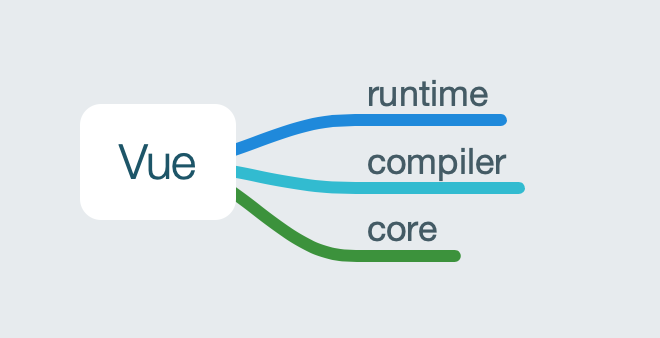
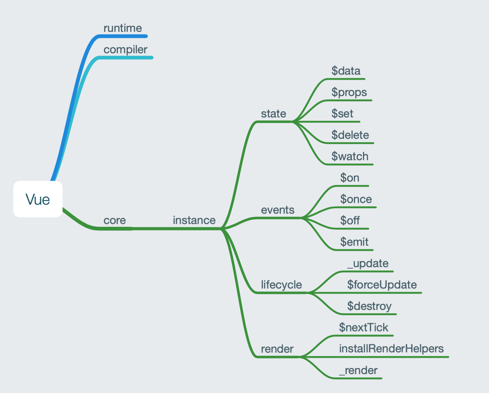

## Vue 构建
- Rollup
    - rollup-plugin-node-resolve: 告诉 rollup 去哪里找这些node modules
    - rollup-plugin-common-js: 使以 commonjs 编写的代码可以通过 es6 module 语法引入
    - rollup-plugin-replace: 指定一个全局变量的值，如 process.env.NODE_ENV, '__VERSION__'(需要外部灵活定义)
    - rooluo-plugin-alias: 别名。避免`../../`重构时的痛苦。

## Vue 架构
我们以 `npm run dev` 即最终生成 `runtime + complier` 的 `umd` 格式的 `Vue` 作为最终的目标。

可以从入口文件`src/platforms/web/entry-runtime-with-compiler.js`一步步追踪，看到一个寻找的过程是：

`
entry-runtime-with-compiler -> runtime -> core -> instance
`

那么我们可以大概规划出 Vue 的架构：

## Vue 实例
在`Vue`的构造函数中，做了两件事：
1. 判断是否通过`new`调用构造函数(`this instanceof Vue`)
2. 调用`_init`方法初始化`options`

该函数的作用只有在调用的时候才会体现，先略过。

接下来我们看到将`Vue`构造函数作为参数传入了`initMixin`, `stateMixin`, `eventsMixin`, `lifecycleMixin`, `renderMixin`这5个方法中，那么我们可以猜测在这几个方法中，肯定对`Vue`构造函数做了手脚，最可能的就是添加原型方法。同时我们也能看出来`Vue`实例分为了：`state`, `event`, `lifecycle`, `render`这几个模块。

同时，这也对我编程过程中的疑问提供了一个解决思路：
**如果一个类有很多原型方法，如果我都写在`class Vue`声明中，那么我的文件可能会成百上千行，这时候我可以把原型方法分类并将原型函数作为参数传入。**

接下来，我们看看每个函数对`Vue`做了什么：
- `initMixin`: 定义`Vue.prototype._init`
- `stateMixin`: 定义`Vue.prototype.$data`, `Vue.prototype.$props`, `Vue.prototype.$set`, `Vue.prototype.$delete`, `Vue.prototype.$watch`。这里声明了`dataDef`, `propsDef`两个对象来代理实例的`this._data`, `this._props`属性，并禁止`set`赋值。
- `eventsMixin`: 定义`Vue.prototype.$on`, `Vue.prototype.$once`, `Vue.prototype.$off`, `Vue.prototype.$emit`
- `lifecycleMixin`: 定义`Vue.prototype._update`, `Vue.prototype.$forceUpdate`, `Vue.prototype.$destroy`
- `renderMixin`: `installRenderHelpers`, `Vue.prototype.$nextTick`, `Vue.prototype._render`

## Vue 静态属性
在看完`instance`之后，我们回到上一个引用它的文件`core`。
之前我们在`instance`中定义了原型方法，这里猜猜我们该定义静态方法了，所以这个文件我们做了这些事：
- `initGlobalAPI` 定义静态方法
-  定义`$isServer`, `$ssrContext` 实例属性
- `FunctionalRenderContext`, `version` 静态属性

`initGlobalAPI`，参考[Vue 官方文档](https://vuejs.org/v2/api/#Global-API)，我们知道给Vue添加了以上的静态实例/属性，并添加了内置的`assets`。
- `config`
- `set`, `delete`, `nextTick`
- `use`, `mixin`, `component`,
- assets: `filter`, `directive`, `component`
- assetsRegister

## Vue.prototype._init